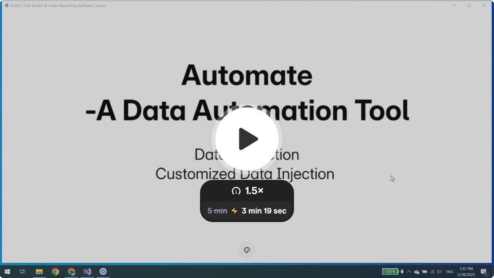

## Automate Readme

###### Usage 
[](https://www.loom.com/share/18a9b1ff2b924a668e13bd1929dbe26a?sid=b271f4ab-76e9-483e-ab76-5b5056993aab)
###### Description
This is a project that inject financial data into cloud-based management software Buildertrend.

###### Dependency
In order to run Automate,  you need Selenium, Tesseract, GemBox.PDF as dependency libraries.
###### Setup Environment
Open Command Prompt.
Go to your directory for Chrome browers for buildertrend, and type command:

```
C:\Program Files (x86)\Google\Chrome\Application>chrome.exe --remote-debugging-port=9999 --user-data-dir=C:\Users\lisa\OneDrive\Documents\Chrome_Test
```
This command build a Chrome Driver directory displays besides Automate project. Only local connections are allowed.
Log in in the Buildertrend Chrome and go to Summary page.


###### Instructions
1st: Open the Chrome browers built for Automate, log into the Buildertrend.
2nd: Open invoice in PDF, extract information from it, or type in, then refresh the list.
3nd: Click Start.


###### Debug
If webpage no respond at the start
----Reopen the spcific Chrome browers built for Automate.
If Automate stop during injections, or the process is interuped by errors.
----Reopen Automate and resume.

